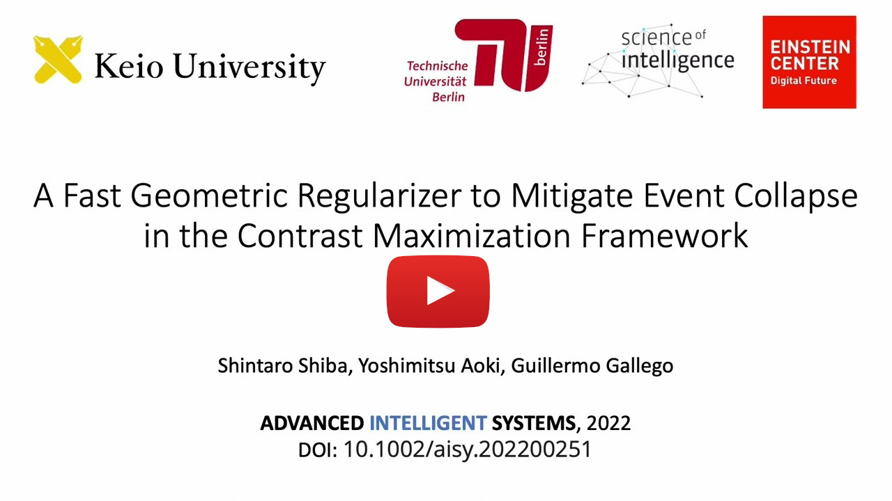

# Event Collapse in Contrast Maximization Frameworks

[](https://youtu.be/IwqA57yaBTo)

This repository collects our work on the topic of overfitting in event alignment frameworks, such as CMax.

* [**A Fast Geometric Regularizer to Mitigate Event Collapse in the Contrast Maximization Framework**](https://arxiv.org/pdf/2212.07350), published at Advanced Intelligent Systems, 2022.

* [**Event Collapse in Contrast Maximization Frameworks**](https://arxiv.org/pdf/2207.04007), published at Sensors, 2022.

If you use this work in your research, please cite it as follows:

```bibtex
author = {Shintaro Shiba and Yoshimitsu Aoki and Guillermo Gallego},  
@article{Shiba22aisy,
  title = {A Fast Geometric Regularizer to Mitigate Event Collapse 
  		   in the Contrast Maximization Framework},
  journal = {Advanced Intelligent Systems},
  year = {2022},
  month = {December},
  doi = {10.1002/aisy.202200251}
}

@article{Shiba22sensors,
  author = {Shintaro Shiba and Yoshimitsu Aoki and Guillermo Gallego},  
  title = {Event Collapse in Contrast Maximization Frameworks},
  journal = {Sensors},
  year = {2022},
  month = {July},
  doi = {10.3390/s22145190}
}
```

### Authors
* [Shintaro Shiba](http://shibashintaro.com/) (Keio Univ., TU Berlin)
* [Yoshimitsu Aoki](https://aoki-medialab.jp/aokiyoshimitsu-en/) (Keio Univ.)
* [Guillermo Gallego](https://sites.google.com/view/guillermogallego) (TU Berlin, ECDF, SCIoI)

 
### Additional Resources on Event-based Vision
-------
* [Secrets of Event-Based Optical Flow (ECCV 2022)](https://github.com/tub-rip/event_based_optical_flow)
* [Research page (TU Berlin RIP lab)](https://sites.google.com/view/guillermogallego/research/event-based-vision)
* [Course at TU Berlin](https://sites.google.com/view/guillermogallego/teaching/event-based-robot-vision)
* [Survey paper](http://rpg.ifi.uzh.ch/docs/EventVisionSurvey.pdf)
* [List of Resources](https://github.com/uzh-rpg/event-based_vision_resources)
